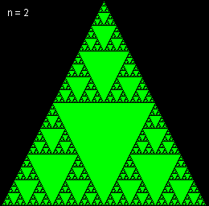
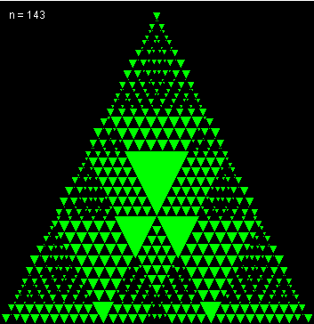

# Pascal's Triangle (mod n)
Pascal's triangle is a truly beautiful structure; elegant yet profound.

```
       1
      1 1
     1 2 1
    1 3 3 1
   1 4 6 4 1
.. and so on ..
```

When considering the divisibility of its elements interesting patterns emerge: for example, on row p (where p is prime), each element, excluding the first and the last, is divisible by p itself! Pascal's triangle is also fractal in nature; if one highlights only the even elements, when viewing 2<sup>n</sup> rows, the larger n is, the more closely it resembles the Sierpinski Triangle.

This program aims to elicit some of that beauty by calculating its elements and then highlighting those elements based on their values modulo some integer.

### Examples
<p align="left">
  
</p>
<p align="left">
  
</p>

### Requirements
- **git** - For cloning
- **Java Development Kit (JDK) 8** (or later) - For compiling and running
- **GNU Make** (or equivalent) - For build automation

### Installation Instructions
To download and compile this program enter the following commands in a terminal:

```
git clone https://github.com/Eirik0/game-template.git
git clone https://github.com/Eirik0/pascal-mod-n.git
cd pascal-mod-n
make
```

### Usage
Left click and right click to increase and decrease n respectively.
